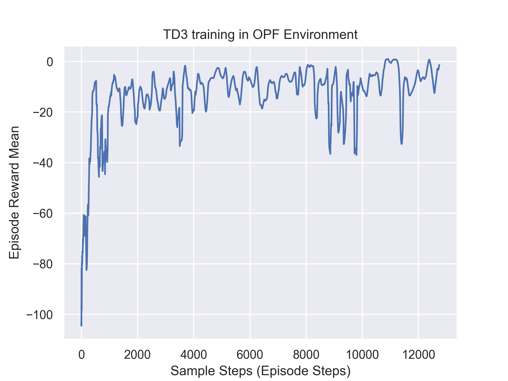
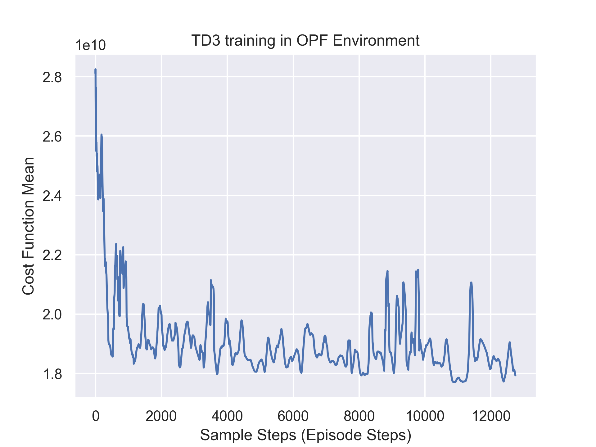
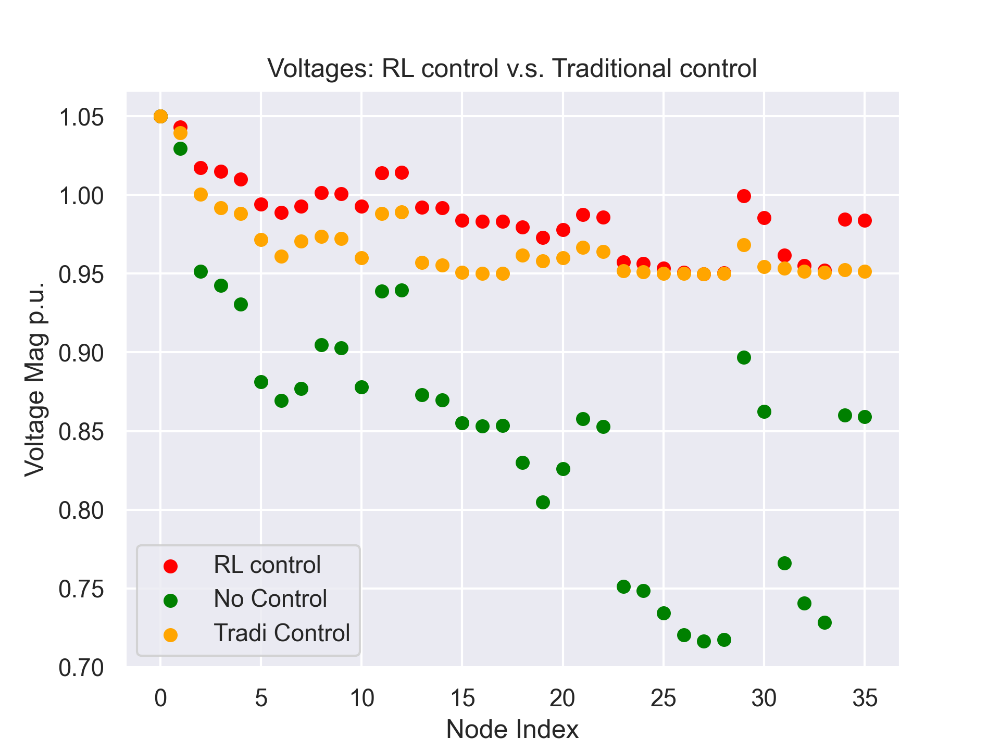

# RL_OPF
The interaction of our agent with the power environment is showed as:

The learning curve of TD3 algorithm and the cost function during training:

Compared with traditional control methods, our RL control scheme achieves the voltages profiles as:

